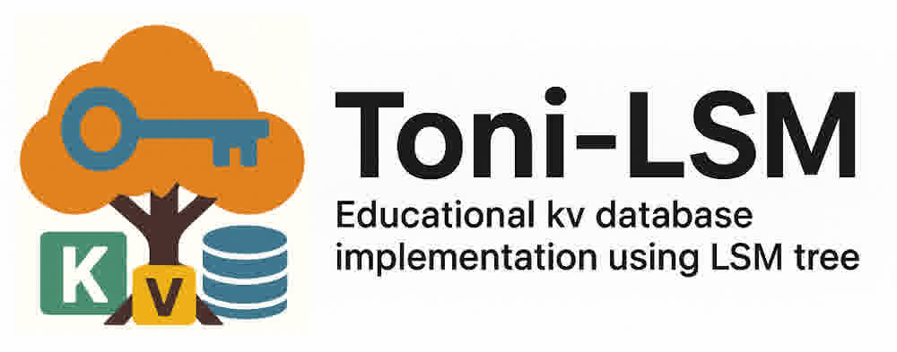
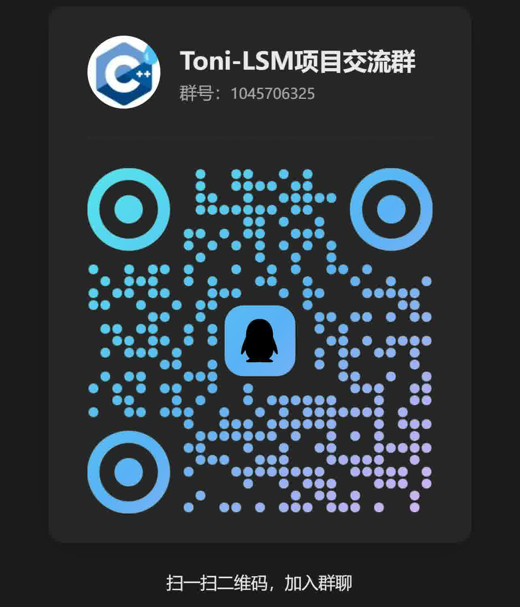
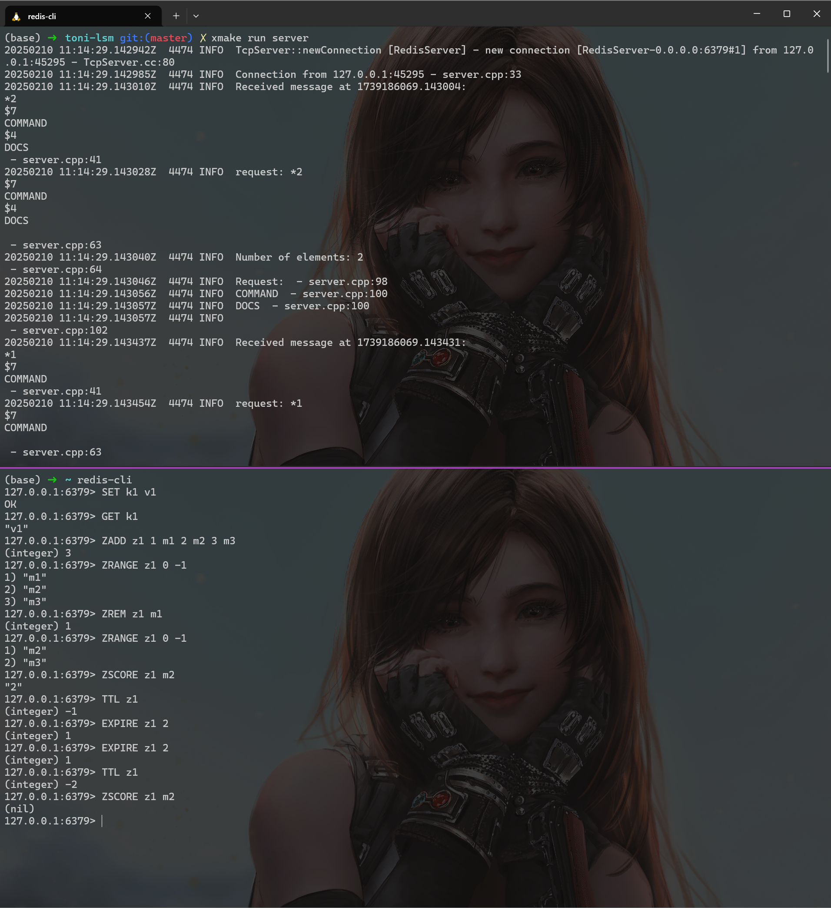

<div style="text-align: center">
  
</div>
<br>

`Toni-LSM` is a educational project to implement a simple kv database from scratch, using lsm-tree as the storage engine. The project manager uses [xmake](https://xmake.io/). The project is inspired by [mini-lsm](https://github.com/skyzh/mini-lsm), [tinykv](https://github.com/talent-plan/tinykv) and [leveldb](https://github.com/google/leveldb). The project is partly compatible with the [Redis Resp protocol](https://redis.io/docs/latest/develop/reference/protocol-spec/), so it can be used as a redis backend and relpace `redis-server`(Just for fun 🎮).

The developing posts can be found in my [blog](https://tonixwd.github.io/categories/%E9%A1%B9%E7%9B%AE/) or [zhihu](https://www.zhihu.com/column/c_1867534978344161280). The is also a recorded video [Course](https://avo6166ew2u.feishu.cn/docx/LXmVdezdsoTBRaxC97WcHwGunOc).

You can also join the QQ group 💬 for discussion: 



## 📚 New: Lab Course Released!

We now offer a complete hands-on **step-by-step Lab course** designed for learners interested in building LSM-based storage engines from scratch.

👉 [**Toni-LSM Lab Course**](https://tonixwd.github.io/toni-lsm/book/)

## 📦 Build Configuration

The project uses xmake as the build system. Below is the xmake configuration for building the project and running tests:

1. Compile the project
```bash
xmake
```

2. Run the example program or test
```bash
xmake run example
xmake run test_lsm
```

3. Install the shared library
```bash
xmake install --root lsm_shared
```

# 🛠️ Usage

## Use as a library

Here is a simple example demonstrating how to use the LSM Tree for basic key-value operations:

```cpp
#include "../include/lsm/engine.h"
#include "../include/lsm/level_iterator.h"
#include <iostream>
#include <string>

using namespace ::tiny_lsm;

int main() {
  // create lsm instance, data_dir is the directory to store data
  LSM lsm("example_data");

  // put data
  lsm.put("key1", "value1");
  lsm.put("key2", "value2");
  lsm.put("key3", "value3");

  // Query data
  auto value1 = lsm.get("key1");
  if (value1.has_value()) {
    std::cout << "key1: " << value1.value() << std::endl;
  } else {
    std::cout << "key1 not found" << std::endl;
  }

  // Update data
  lsm.put("key1", "new_value1");
  auto new_value1 = lsm.get("key1");
  if (new_value1.has_value()) {
    std::cout << "key1: " << new_value1.value() << std::endl;
  } else {
    std::cout << "key1 not found" << std::endl;
  }

  // delete data
  lsm.remove("key2");
  auto value2 = lsm.get("key2");
  if (value2.has_value()) {
    std::cout << "key2: " << value2.value() << std::endl;
  } else {
    std::cout << "key2 not found" << std::endl;
  }

  // iterator
  std::cout << "All key-value pairs:" << std::endl;
  // begin(id): id means transaction id, 0 means disable mvcc
  for (auto it = lsm.begin(0); it != lsm.end(); ++it) {
    std::cout << it->first << ": " << it->second << std::endl;
  }

  // transaction
  auto tranc_hanlder = lsm.begin_tran(IsolationLevel::REPEATABLE_READ);
  tranc_hanlder->put("xxx", "yyy");
  tranc_hanlder->put("yyy", "xxx");
  tranc_hanlder->commit();

  auto res = lsm.get("xxx");
  std::cout << "xxx: " << res.value() << std::endl;

  lsm.clear();

  return 0;
}
```

## Use to replace redis-server
⚠️ Now the project only partly compatible with the Redis Resp protocol, you can check `TODO` for the supported Redis commands.
```bash
xmake run server
```
Then you can use redis-cli to connect to the server:



**The project is under development, and the current version is not stable.**

# 📈 Benchmark
We use the official tool `redis-benchmark` to test the performance of the wrapper redis server. The QPS of commonly used commands are relatively high, considering its IO between memroy and disk.
> 🔍 The testing environment is: Win11 WSL Ubuntu 22.04, 32GB 6000 RAM, Intel 12600K. 

```bash
(base) ➜  ~ redis-benchmark -h 127.0.0.1 -p 6379 -c 100 -n 100000 -q -t SET,GET,INCR,SADD,HSET,ZADD
WARNING: Could not fetch server CONFIG
SET: 142653.36 requests per second, p50=0.527 msec
GET: 134589.50 requests per second, p50=0.503 msec
INCR: 132802.12 requests per second, p50=0.503 msec
SADD: 131233.59 requests per second, p50=0.519 msec
HSET: 123456.79 requests per second, p50=0.583 msec
ZADD: 126422.25 requests per second, p50=0.615 msec
```
> 🔍 Besides, the QPS of `lpush/rpush` is so slow that its design needs to be optimized.

The performance of the wrapper redis server is not very good, but it is still fast enough for most use cases. Howerver, the redis server is built based on the LSM Tree KV engine, so it consists of some redundancy locks. If you use the LSM Tree KV engine directly, you can get much better performance. The reason why we use `redis-benchmark` to test the compatible redis api but not the actual KV engine API is that writing a sophisticated testing tool costs much time so we choose to use the existed `redis-benchmark`.


# ✅ Features && TODO
- [x] SkipList
  - [x] get/put/remove
  - [x] iterator
  - [x] Range Query
- [x] MemTable
  - [x] Iterator
  - [x] Range Query
  - [x] flush to sst
- [x] SST
  - [x] Encode/Decode
  - [x] Iterator
  - [x] Query
  - [x] Range Query
  - [x] Compact
- [x] Wal
  - [x] Sync Wal
  - [ ] Async Wal
  - [x] Recover
- [x] Transaction
  - [x] MVCC
  - [x] Isolation Level
    - [x] Read Uncommitted
    - [x] Read Committed
    - [x] Repeatable Read (Default)
    - [ ] Serializable
- [x] Config
  - [x] Toml Config
- [x] Redis
  - [x] Fundamental KV Operations
    - [x] set/get
    - [x] ttl/expire
  - [x] Hash Operations
    - [x] hset/hget/hdel
    - [x] hkeys
  - [x] List Operations
    - [x] lpush/rpush/lpop/rpop
    - [x] llen
    - [x] lrange
  - [x] ZSet
    - [x] ZADD/ZREM/ZINCRBY
    - [x] ZCARD
    - [x] ZRANGE
    - [x] ZSCORE
    - [x] ZRANK
  - [x] Set
    - [x] SADD/SREM
    - [x] SMEMBERS/SISMEMBER
    - [x] SCARD
  - [x] IO Operations
    - [x] FLUSHALL
    - [x] SAVE
  - [x] SDK
    - [x] Python

> 🔍 Only commonly used redis commands are supported. The other implementations can refer to `src/redis_wrapper/redis_wrapper.cpp`. If you need more commands, please submit a pull request. 

## Redis Resp
Currently, the project only supports a subset of the Redis Resp protocol. The supported commands are listed above. You can add more commands by following the existing implementations in `src/redis_wrapper/redis_wrapper.cpp`.


## 🧪 SDK Development
If you want to develop a new SDK for the project, please refer to the existing SDKs in `src/sdk/`. Curently, we only have a Python SDK. You can use build the python sdk as following:
```bash
cd sdk
./build_python_sdk.sh
```
Then you can use the SDK in your Python code:
```python
import tonilsm

db = tonilsm.LSM("test2_db")
db.put(b"tomxx", b"catxx")
db.get("tomxx")

t = db.begin_tran()
t.get('tomxx')
t.put('tomxx','1')
t.get('tomxx')
t.commit()

db.get("tomxx")
```
We welcome contributions for developing SDKs in other programming languages.

# 🤝 Contribute
If you want to contribute to the project, please check the [issues](https://github.com/ToniXWD/toni-lsm/issues). Also, you can concat me by 📧 [xwdtoni@126.com](mailto:xwdtoni@126.com)

## Lab Construction
I have a plan to make this project a step-to-step Lab like `CMU15445` or `MIT 6.824`. If you are interested in this project, please feel free to contact me by 📧 [xwdtoni@126.com](mailto:xwdtoni@126.com)

Besides, the branch `lab-dev` is a development branch for the lab construction.

# 📜 License

This project is licensed under the MIT License.